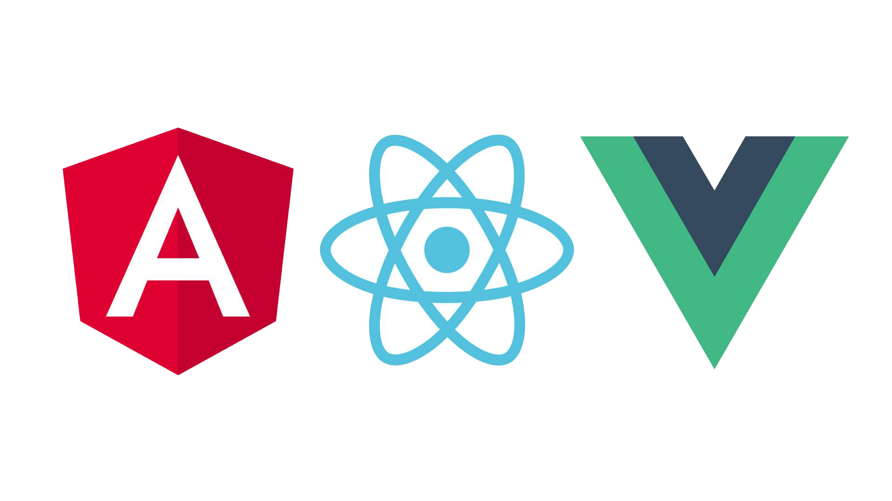

<h1 align="center">Hey! </h1>
<h3 align="center">Been trying to meet you</h3>

### Hola 👋

 ✏️ Placeholder mientras se me ocurre algo. Boop Beep Boop

----------------------------------------------------

### Hello there 👋

✏️ Placeholder while i think of something. Boop Beep Boop

----------------------------------------------------

<h3 align="center">Tech Skills ✨</h3>

     

  

----------------------------------------------------

### Puedes encontrarme en / Find me on 📓 

 